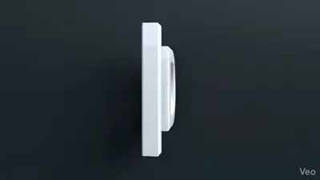
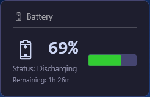
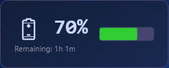
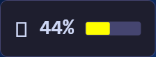
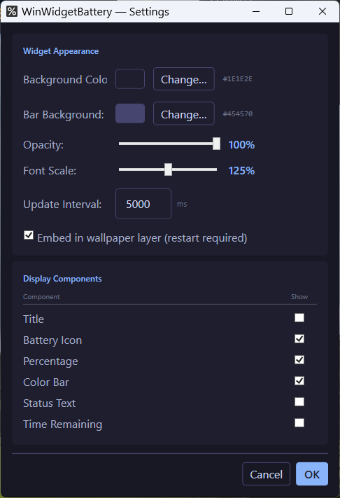
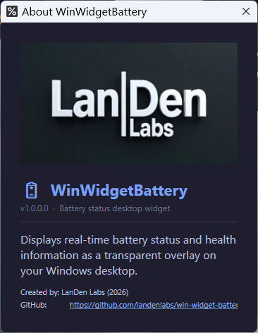

<table border="0">
  <tr>
    <td>
      3-Apr-2026<br>
      Windows<br>
      <a href="https://landenlabs.com/android/index.html">Home</a>
    </td>
    <td>
      <a href="https://landenlabs.com/android/index.html">
        
      </a>
    </td>
  </tr>
</table>

# WinWidgetBattery
[](https://github.com/landenlabs/win-widget-time/actions/workflows/build.yml)


A lightweight Windows desktop widget that displays real-time battery status as a transparent overlay directly on your desktop. Built with WPF and .NET 10.



**By [LanDen Labs](https://github.com/landenlabs) (2026)**

## Features

- **Real-time battery monitoring** — percentage, charging state, and estimated time remaining
- **Color-coded status bar** — green (charging or ≥50%), yellow (20–49%), red (<20%)
- **Transparent overlay** — floats on the desktop or embeds in the wallpaper layer (behind all windows)
- **Draggable** — click and drag to reposition anywhere on screen
- **Multi-monitor aware** — remembers widget position per display configuration
- **Multiple widgets** — add or remove widgets from the system tray menu
- **Fully customizable** — toggle individual display components, adjust colors, opacity, font scale, and update interval
- **Single instance** — prevents duplicate instances from running

## Screenshots

### Widget Examples

  
  
  

### Settings



### About



## Requirements

- Windows 10 or Windows 11
- [.NET 10.0 Runtime](https://dotnet.microsoft.com/download/dotnet/10.0)

## Build

```bash
dotnet build WinWidgetBattery.slnx -c Release
```

Or open `WinWidgetBattery.slnx` in Visual Studio 2022+.

## Usage

1. Run `WinWidgetBattery.exe` — the widget appears on screen and a tray icon appears in the system tray.
2. **Drag** the widget to your preferred position.
3. **Right-click** the widget or tray icon to access the context menu:
   - **Settings** — customize appearance and display components
   - **About** — version and app info
   - **Add Widget** — create an additional widget instance
   - **Remove Widget** — remove the current widget
   - **Exit** — close the application

## Settings

Access via right-click → **Settings** or the tray icon menu.

### Widget Appearance

| Setting | Description |
|---------|-------------|
| Background Color | Widget background color (hex color picker) |
| Bar Background | Color of the battery bar track |
| Opacity | Background transparency (0–100%) |
| Font Scale | Text size multiplier (50–200%) |
| Update Interval | How often battery status is polled (milliseconds) |
| Embed in wallpaper layer | Places widget behind all windows (requires restart) |

### Display Components

Each component can be toggled on or off independently:

| Component | Description |
|-----------|-------------|
| Title | "Battery" header label |
| Battery Icon | Emoji battery icon |
| Percentage | Numeric charge percentage |
| Color Bar | Horizontal fill bar |
| Status Text | Charging / Discharging / Low Battery / Critical Battery |
| Time Remaining | Estimated time left on battery |

## Configuration

Settings are persisted automatically to:

```
%APPDATA%\WinWidgetBattery\settings.json
```

Widget position is saved per display configuration so the widget returns to the correct position when monitors are added, removed, or rearranged.

## Project Structure

```
WinWidgetBattery/
├── Models/
│   ├── AppSettings.cs          # App and widget settings models
│   └── DisplayConfiguration.cs # Multi-monitor position tracking
├── Services/
│   ├── BatteryService.cs       # Win32 GetSystemPowerStatus wrapper
│   ├── SettingsService.cs      # JSON settings persistence
│   └── TrayIconService.cs      # System tray icon and menu
├── ViewModels/
│   └── BatteryViewModel.cs     # MVVM view model for battery data
├── Windows/
│   ├── WidgetWindow.xaml       # Main floating widget UI
│   ├── SettingsWindow.xaml     # Settings dialog
│   ├── AboutWindow.xaml        # About dialog
│   └── ColorPickerWindow.xaml  # Color picker dialog
└── App.xaml.cs                 # App lifecycle, tray icon, widget management
```

## License

Copyright © 2026 LanDen Labs

Licensed under the [Apache License 2.0](LICENSE.txt).
