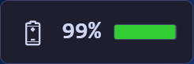

<table border="0">
  <tr>
    <td>
      17-May-2026<br>
      Windows<br>
      <a href="https://landenlabs.com/index.html">Home</a>
    </td>
    <td>
      <a href="https://landenlabs.com/index.html">
        
      </a>
    </td>
  </tr>
</table>

# WinWidgetBattery

[](https://github.com/landenlabs/win-widget-battery/actions/workflows/build.yml)


A lightweight Windows desktop widget that displays real-time battery status as a transparent overlay directly on your desktop wallpaper. Built with WPF and .NET 10.

**By [LanDen Labs](https://github.com/landenlabs) (2026)**

---

## Screenshots

**Widget examples**


   

**Settings dialog**


**About dialog**


---

## Features

- **Real-time battery monitoring** — percentage, charging state, and estimated time remaining
- **Color-coded status bar** — green (charging or ≥50%), yellow (20–49%), red (<20%)
- **Device batteries** — shows Bluetooth and connected device battery levels
- **Transparent overlay** — sits directly on the desktop wallpaper, no taskbar clutter
- **Drag to reposition** — click and drag the widget anywhere on the desktop *(Windows 11)*
- **Screen-map position picker** — drag a scaled widget marker across a miniature monitor map inside Settings to reposition the widget *(Windows 10 & 11 — see [Windows 10 notes](#windows-10-notes))*
- **Multi-monitor aware** — position saved per monitor layout; snaps to a safe position if the saved location is off-screen
- **Fully customizable** — toggle individual display components, adjust colors, opacity, font scale, and update interval
- **Multiple widgets** — add or remove widget instances from the system tray menu
- **Wallpaper embed mode** — render the widget at the wallpaper layer (below all windows)
- **Dark theme** — Catppuccin Mocha palette throughout
- **Persistent settings** — saved to `%AppData%\WinWidgetBattery\settings.json`

---

## Requirements

- Windows 10 or Windows 11
- [.NET 10.0 Desktop Runtime](https://dotnet.microsoft.com/en-us/download/dotnet/10.0) — install once; no SDK required

---

## Windows 10 Notes

### Drag limitation

On **Windows 10**, the desktop widget cannot be dragged directly on screen. This is caused by a Windows 10 incompatibility between WPF's `AllowsTransparency` and `WindowStyle="None"` — the combination that transparent widgets require. The drag operation silently fails.

**Windows 11** does not have this limitation; direct drag works normally.

### Workaround — Screen-map position picker

Open **Settings** (hover the widget and click ⚙, or right-click → Settings) and scroll to the **Widget Position** panel:

```
Widget Position ─────────────────────────────── X: 120  Y: 200
┌──────────────────────────────────────────────────────────────┐
│  ┌────────────────────────────┐  ┌─────────────────────┐    │
│  │  Primary                   │  │  2560×1440          │    │
│  │        ▓▓▓▓▓               │  └─────────────────────┘    │
│  └────────────────────────────┘                              │
└──────────────────────────────────────────────────────────────┘
  Drag the blue marker to reposition the widget — it moves live.
```

- The canvas shows **all connected monitors** scaled to fit
- The **blue marker** represents the widget at its current position
- Drag the marker to the desired location — **the widget moves live** as you drag
- Click **OK** to keep the new position, or **Cancel** to restore it
- The X / Y coordinates update in real-time as you drag

This approach works on Windows 10 because the Settings dialog is a normal opaque window that does not require transparency.

---

## Installation

### Option A — Download release zip

1. Go to [Releases](https://github.com/landenlabs/win-widget-battery/releases)
2. Download `WinWidgetBattery.zip`
3. Extract to any folder (e.g. `C:\opt\bin\winwidgets\`)
4. Run `WinWidgetBattery.exe`

> The release zip contains a single self-contained `WinWidgetBattery.exe` plus an `Assets\` folder.  
> You must have [.NET 10.0 Desktop Runtime](https://dotnet.microsoft.com/en-us/download/dotnet/10.0) installed.

### Option B — Build from source

```cmd
git clone https://github.com/landenlabs/win-widget-battery.git
cd win-widget-battery
install.bat
```

The `install.bat` script publishes the project and copies the output to `C:\opt\bin\winwidgets\`.

---

## Usage

| Action | Result |
|--------|--------|
| **Hover** | Reveals ⚙ Settings and ? About buttons |
| **Click battery row** | Opens Windows battery settings |
| **Click device row** | Opens Windows Bluetooth / connected devices settings |
| **Drag** | Repositions the widget *(Windows 11 only — use Settings on Windows 10)* |
| **Right-click** | Opens context menu (Settings / About / Add / Remove / Exit) |

---

## Settings

Access via right-click → **Settings** or the tray icon menu.

### Widget Appearance

| Setting | Description |
|---------|-------------|
| Background Color | Widget background color |
| Bar Background | Color of the battery bar track |
| Opacity | Background transparency 0–100% — updates live |
| Font Scale | Text size 50–200% — updates live |
| Update Interval | How often battery status is polled (milliseconds) |
| Embed in wallpaper layer | Places widget behind all windows (requires restart) |

### Display Components

Each component can be toggled on or off independently:

| Component | Description |
|-----------|-------------|
| Title | "Battery" header label |
| Battery Icon | Emoji battery icon |
| Percentage | Numeric charge percentage |
| Color Bar | Horizontal fill bar |
| Status Text | Charging / Discharging / Low Battery / Critical Battery |
| Time Remaining | Estimated time left on battery |
| Device Batteries | Bluetooth / connected device battery levels |

### Widget Position

A miniature map of your monitor layout. Drag the **blue marker** to move the widget anywhere on any screen. The widget repositions live as you drag. Coordinates are shown in the header. Changes are applied on **OK** and reverted on **Cancel**.

Settings are saved to `%APPDATA%\WinWidgetBattery\settings.json`.

---

## Building from Source

### Prerequisites

- [.NET 10 SDK](https://dotnet.microsoft.com/en-us/download/dotnet/10.0)
- Windows (WPF requires a Windows build host)

### Build

```cmd
dotnet build WinWidgetBattery.csproj -c Release
```

### Publish (FDD single-file, win-x64)

```cmd
dotnet publish WinWidgetBattery.csproj -c Release -r win-x64 --self-contained false -p:PublishSingleFile=true
```

Output: `bin\Release\publish\`

This produces a **single `WinWidgetBattery.exe`** (all managed assemblies bundled) plus the `Assets\` folder. Users need only the .NET 10 Desktop Runtime — no SDK required.

### Build and install via batch script

```cmd
install.bat
```

Kills any running instance, publishes, and copies all files to `C:\opt\bin\winwidgets\`.

---

## Project Structure

```
WinWidgetBattery/
├── Models/
│   ├── AppSettings.cs          # App and widget settings models
│   └── DisplayConfiguration.cs # Multi-monitor position tracking
├── Services/
│   ├── BatteryService.cs       # Win32 GetSystemPowerStatus wrapper
│   ├── DesktopService.cs       # Wallpaper embed / Win32 window helpers
│   ├── DeviceBatteryService.cs # Bluetooth / connected device battery polling
│   ├── DisplayService.cs       # Per-monitor position save/restore
│   ├── SettingsService.cs      # JSON settings persistence
│   └── TrayIconService.cs      # System tray icon and menu
├── Windows/
│   ├── AboutWindow.xaml        # About dialog
│   ├── ColorPickerWindow.xaml  # Color picker dialog
│   ├── SettingsWindow.xaml     # Settings dialog (incl. screen-map position picker)
│   └── WidgetWindow.xaml       # Main widget overlay
├── Assets/
│   ├── landenlabs.mp4          # Animated logo (About dialog)
│   └── landenlabs.png          # Static logo fallback
└── install.bat                 # Build and install script
```

---

## License

Apache 2.0 © [LanDen Labs](https://github.com/landenlabs) 2026
